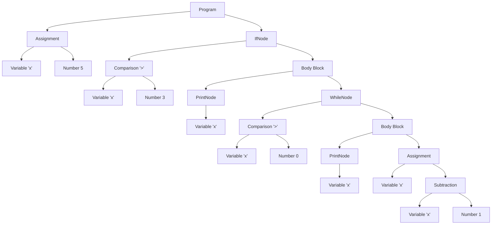

# Tiny Language Interpreter

## Overview
This project implements an interpreter for a simple programming language that supports basic control flow, variables, and arithmetic operations. The interpreter uses a tree-walking approach, directly executing Abstract Syntax Tree (AST) nodes as they are traversed.

## Key Differences Between Interpreters and Compilers

1. **Execution Model**
   - **Interpreter**: Executes code directly by walking through an Abstract Syntax Tree (AST)
   - **Compiler**: Translates code into machine instructions or intermediate representation for later execution

2. **Memory Management**
   - **Interpreter**: Maintains a runtime environment with variables and their values in memory
   - **Compiler**: Generates code for memory allocation and variable access

3. **Control Flow**
   - **Interpreter**: Handles control flow through direct execution of condition checks and loops
   - **Compiler**: Generates jump instructions and labels for control flow

4. **Error Handling**
   - **Interpreter**: Can provide immediate runtime error feedback
   - **Compiler**: Must generate error-checking code in the target program

## Project Architecture

### Core Components

1. **Lexer**
   - Converts source code into tokens
   - Handles keywords, identifiers, numbers, and operators
   - Tracks line numbers for error reporting

2. **Parser**
   - Implements recursive descent parsing
   - Converts token stream into AST
   - Handles language grammar rules
   - Manages block structure and indentation

3. **AST Nodes**
   - Represent program structure
   - Each node type implements its own execution logic
   - Types include:
     - NumberNode
     - VariableNode
     - AssignmentNode
     - PrintNode
     - IfNode
     - WhileNode
     - ComparisonNode

4. **Environment** (part of `ast.hpp`, `ast.cpp`)
   - Manages variable storage and access
   - Handles variable definition and assignment

### Program Flow

1. **Source Code → Tokens**
   ```
   x = 5
   if x > 3
     print x
     while x > 0
     print x
     x = x - 1
   ```
   ↓ (Lexer processes)
   ```
   [IDENTIFIER:x] [EQUALS] [NUMBER:5] [EOL]
   [IF] [IDENTIFIER:x] [GREATER] [NUMBER:3] [EOL]
   [PRINT] [IDENTIFIER:x] [EOL]
   ```

2. **Tokens → AST**
   - Parser reads tokens and builds tree structure
   - Each language construct becomes a node
   - Nodes are linked to form program structure



This diagram shows how the interpreter organizes the program structure:
- Each assignment, control flow statement, and expression becomes a node
- Parent nodes contain their child expressions and statement blocks
- The tree structure allows for recursive evaluation of expressions and statements

3. **AST → Execution**
   - Tree is walked in order
   - Each node's `execute()` method is called
   - Environment tracks program state

## Language Features

### Supported Syntax
```
# Assignment
variable = value

# If statement
if condition
  statement1
  statement2

# While loop
while condition
  statement1
  statement2

# Print statement
print expression
```

### Data Types
- Integers
- Boolean conditions (through comparisons)

### Operations
- Assignment (=)
- Comparison (>, <)
- Arithmetic (-)

## Building and Running

### Prerequisites
- CMake (version 3.12 or higher)
- C++ compiler with C++17 support
- Make or equivalent build tool

### Build Instructions
```bash
# Create build directory
mkdir build
cd build

# Generate build files
cmake ..

# Build the project
make

# Run the interpreter
./tiny_interpreter
```

### Example Program
```cpp
// Create a source string
std::string source = 
    "x = 5\n"
    "if x > 3\n"
    "  print x\n"
    "  while x > 0\n"
    "    print x\n"
    "    x = x - 1\n";

// Run the interpreter
Lexer lexer(source);
auto tokens = lexer.tokenize();
Parser parser(tokens);
auto statements = parser.parse();
Environment env;
for (const auto& stmt : statements) {
    stmt->execute(env);
}
```

## Design Decisions

1. **Tree-Walking Interpreter**
   - Chose direct AST execution for simplicity and clarity
   - Suitable for educational purposes and small languages
   - Trade-off: Less efficient than bytecode interpretation or compilation

2. **Smart Pointer Usage**
   - Used `std::unique_ptr` for automatic memory management
   - Ensures proper cleanup of AST nodes
   - Prevents memory leaks in error cases

3. **Error Handling**
   - Runtime errors throw exceptions with descriptive messages
   - Line numbers included for error reporting
   - Basic error recovery in main loop
